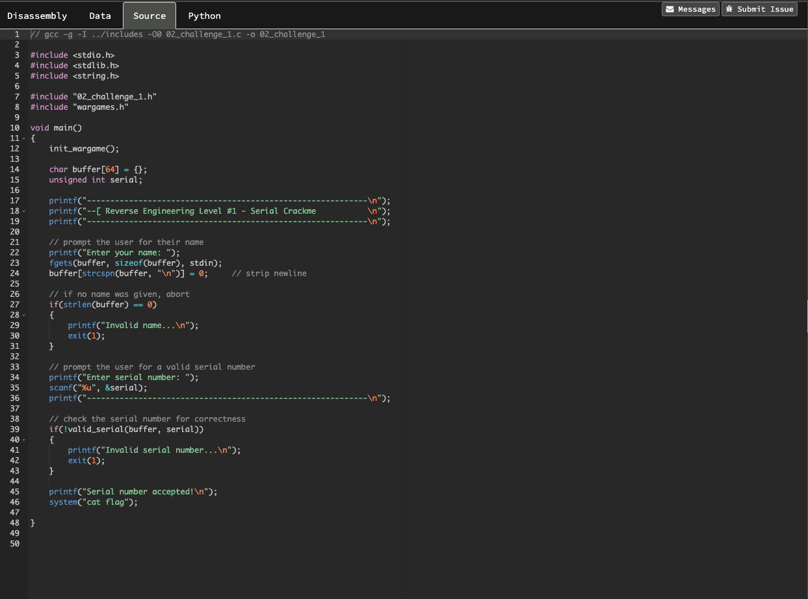
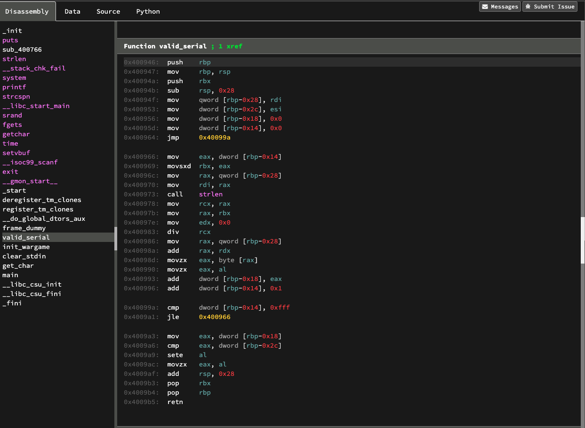

# Notes on the Level 1 Reverse Engineering challenge 
## Valid Serial

### We are given a binary which has been disassembled and have access to the ASM instructions through a similar interface to Binary Ninja. The C source is limited, only showing the main function, which is just an overview of what the program does i.e Enter a name, check the name is non zero or abort, then enter a serial number and check if its valid or abort.

## The Mission
### Serial CrackMe
We've gotten access to a specialized piece of software... but we can't use it! It keeps asking us for our name and a serial number. Can you help us get around this?? 

## C Source



## Disassembly (ASM)



## What now?

To solve the challenge we have to reverse engineer the algorithm used to produce a valid serial. The challenge also gives us access to a debugger, so we can step through the code and inspect register values or memory locations. 

The first step is to figue out what the assembly routine is doing :confused:

## C Code Review
There's not much here. The important bits are:

```c
 // if no name was given, abort
    if(strlen(buffer) == 0)
    {
        printf("Invalid name...\n");
        exit(1);
    }
```
As mentioned before, we have to give a name with a length of at least one character to get past the first prompt

The next important thing to note is the serial number section:

```c
    // prompt the user for a valid serial number
    printf("Enter serial number: ");
    scanf("%u", &serial);
    printf("------------------------------------------------------------\n");

    // check the serial number for correctness
    if(!valid_serial(buffer, serial))
    {
        printf("Invalid serial number...\n");
        exit(1);
    }
```
The declaration for serial is `unsigned int` and this is stored in a 4 byte sized variable. The code snippet above takes the serial number from the user, then runs the `valid_serial` function to check if the provided serial is valid.

This is where our C code review stops, since we do not have access to anymore C source files. This makes sense, since the point of the challenge is to reverse engineer the binary and use the dissassembled instructions in ASM and the debugger to derive a valid serial. 

With this in mind, the next step is to review the disassembled instructions.

## Disassembly Static Analysis

The first thing to note is that the routine is broken down into sections which is controlled by loops and comparisons. The first section of instructions sets up the stack with the required space and saves the function arguments to memory locations.

```asm
0x400946:  push    rbp
0x400947:  mov     rbp, rsp
0x40094a:  push    rbx
0x40094b:  sub     rsp, 0x28
0x40094f:  mov     qword [rbp-0x28], rdi
0x400953:  mov     dword [rbp-0x2c], esi
0x400956:  mov     dword [rbp-0x18], 0x0
0x40095d:  mov     dword [rbp-0x14], 0x0
0x400964:  jmp     0x40099a
```
- The `esi` register holds the input taken from scanf when the user was prompted for a `serial`. This is copied into the memory location `rbp-0x2c`.
- The `rdi` register will contain the `name` that was entered by the user. This is saved into memory location `rbp-0x28`
- The next 2 instructions at `0x400956` and `0x40095d` save `0` to memory location `rbp-0x18` and `rbp-0x14`. These will be used in the function as counters which will be shown shortly.
- The final instruction in this code block at `0x400964` is a `jmp` to memory location `0x40099a`, which is the beginning of the next set of instructions.

```asm
0x400966:  mov     eax, dword [rbp-0x14]
0x400969:  movsxd  rbx, eax
0x40096c:  mov     rax, qword [rbp-0x28]
0x400970:  mov     rdi, rax
0x400973:  call    strlen
0x400978:  mov     rcx, rax
0x40097b:  mov     rax, rbx
0x40097e:  mov     edx, 0x0
0x400983:  div     rcx
0x400986:  mov     rax, qword [rbp-0x28]
0x40098a:  add     rax, rdx
0x40098d:  movzx   eax, byte [rax]
0x400990:  movzx   eax, al
0x400993:  add     dword [rbp-0x18], eax
0x400996:  add     dword [rbp-0x14], 0x1
```

```asm
0x40099a:  cmp     dword [rbp-0x14], 0xfff
0x4009a1:  jle     0x400966
```

The instructions between `0x400966` and `0x400996` form the bulk of the logic for the `valid_serial` function. 
The 2 instructions after this block at `0x40099a` and `0x4009a1` make a comparison with the contents of memory location `rbp-0x14` and `0xfff` (4095). If the value of `rbp-0x14` is less than 4095 `0xfff` then the excution is moved back to the instruction at `0x400966`. This forms a loop.

