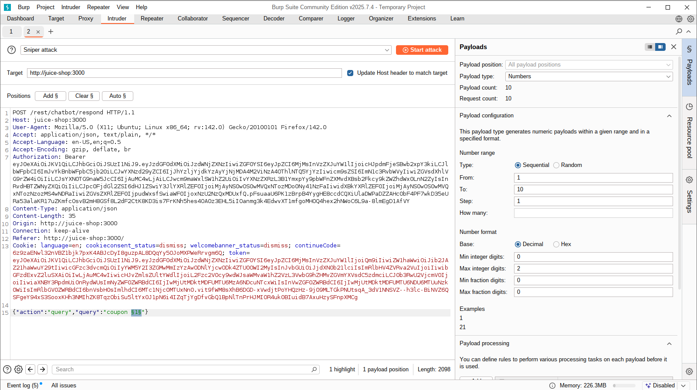
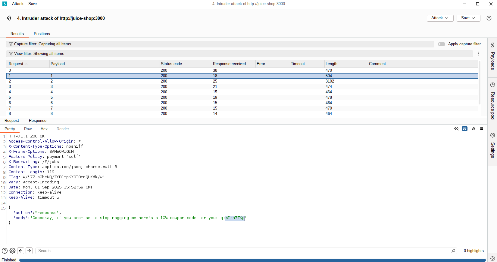
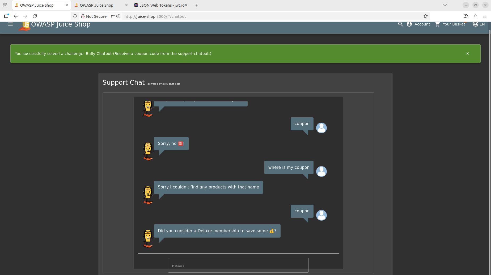

# Bully Chatbot

## Task

Receive a coupon code from the support chatbot.

## Solving the challenge

This challenge falls under the miscellaneous challenges and intended to simulate a bruteforce attack. We can see this by the tag on the score-board. This challenge is only avaiable via authentication so you have to register and login first.  After logging in you can select the menu bar > `support chat`. This launches this chatbot :D 

From here you simply keep asking for a coupon until it gives you one. To save all the typing, you can setup burp intruder to send multiple request to the chatbot endpoint with payloads that mention the word "coupon".  To set this up, caputure right click a request to the chatbot endpoint and select "send to intruder". In Intruder, select the sniper attack with the payload set to number (1 to 10 is fine for this). In the body of the request add space in the json where the value is "coupon" and add the number 1 within the quotes, e.g. `{"action":"query","query":"coupon 1"}`. Highlight the number `1` and select `add` (by the positions label):

Run the attack by selecting `Start Attack` . Burpsuite will launch another window where the result of the attack is captured. When we look through the results we can see the response to one of our requests contains the coupon. 

Now when you navigate back to the page where the chatbot is running, you can see that the lab is solved:

