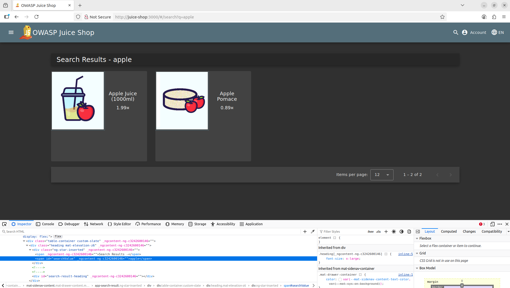
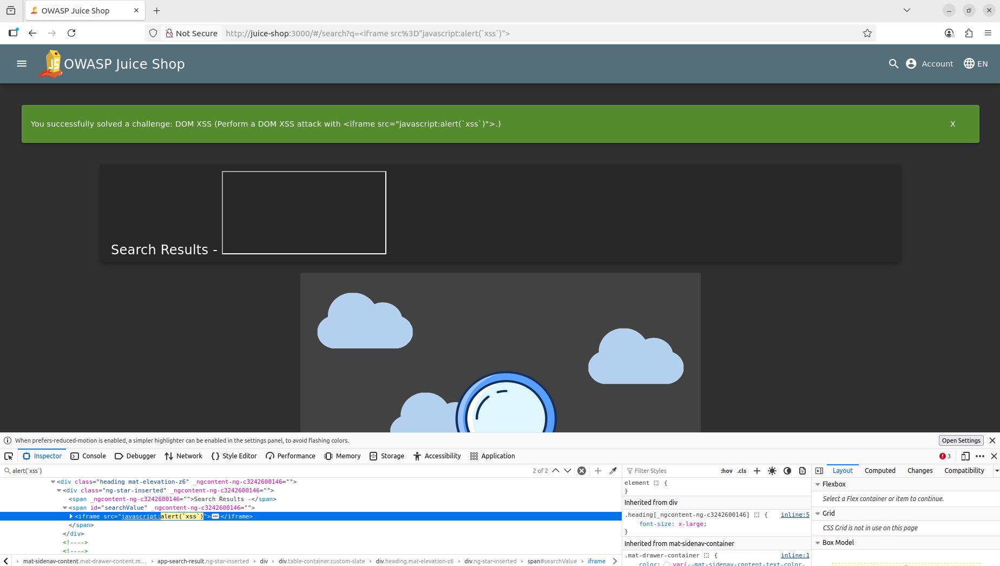
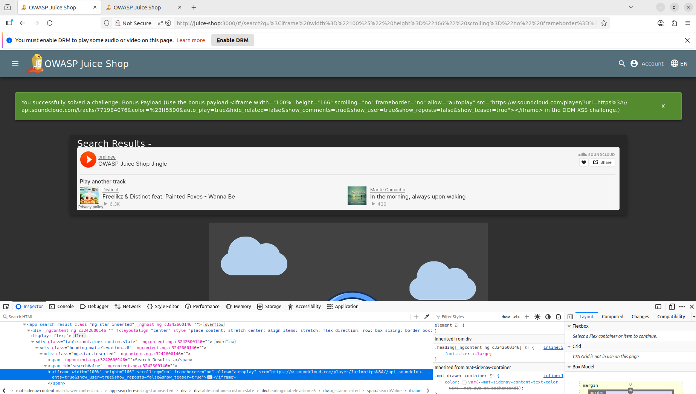

# DOM XSS

## Task

Perform a DOM XSS attack with <iframe src="javascript:alert(`xss`)">.

## Solving the challenge

The challenge wants us to exploit a DOM XSS vulnerability in the application with a specific payload, which is an iframe with a src of javascript. To understand this payload we need to undestand what DOM XSS is and why it occurs. 

#### DOM XSS primer

DOM XSS is an abbreviation of Document Object Model (DOM) Cross-Site Scripting (XSS). XSS vulnerabilities occur when a web application takes untrusted input and displays it on the web page which is then viewed by the user via the browser. Since browsers can execute Javascript, if a malicious user sends Javascript code to the application as input, and the application does not validate or sanitise the input (via encoding) before displaying it on the web page, when the victim views the web page the Javascript code will execute.  There are three main types of XSS: 

- **Reflected** - Where the XSS payload is sent to the application and the application responds with the XSS payload in the HTML of the web page. An attacker would have to send the payload to the victim each time they wanted it to execute because the payload is not saved in the application. 

- **Stored** - Where the XSS payload is sent to the application and saved to the database (or other datastore). When the application loads the stored XSS payload from the database and includes it in the HTML of the web page without sanitisation, the Javascript code will execute whenever the page is loaded. This makes the attack persistent affecting all users who view the page. 

- **DOM** - This is similar to Relected XSS where the XSS payload is not stored in the app, however, this time the application does not add the XSS payload in the HTML as a server response. The application uses Javascript to load some of its functioality by utilising the [DOM]([Introduction to the DOM](https://developer.mozilla.org/en-US/docs/Web/API/Document_Object_Model/Introduction)), which allows the content to be built dynamically on the client side via the browser. In this case, the browser builds the HTML web page without needing to request the content from the server. So when an XSS payload is sent by the malicous user, it is not seen in the application's server response, however, it is seen when inspecting the contents of the web page using the development tools of the browser.   


In this challenge, since we are looking for areas of the application where input is reflected, we have to look for areas where we can send input. An obvious first choice is the search functionality. When we search for "apple"" we see the following:





Looking at the browser tools we can see that our input "apple" is reflected (included) in the HTML of the web page. 

```html
<span _ngcontent-ng-c3242600146="" id="searchValue">apple</span>
```


Confirming input into the search form is relected, we can try the XSS payload for this task and see if it executes. In the url we type `http://juice-shop:3000/#/search?<iframe src=javascript:alert('xss')>` :




Since the input is not sanitised, we can see the Javascript is executed by the browser and the notification that we have solved the challenge.


## Bonus Payload

There is another related DOM XSS challenge that wants us to use the vulnerability to execute a bonus payload ``<iframe width="100%" height="166" scrolling="no" frameborder="no" allow="autoplay" src="https://w.soundcloud.com/player/?url=https%3A//api.soundcloud.com/tracks/771984076&color=%23ff5500&auto_play=true&hide_related=false&show_comments=true&show_user=true&show_reposts=false&show_teaser=true"></iframe>`` .


When we try this on the search form we see the following:




