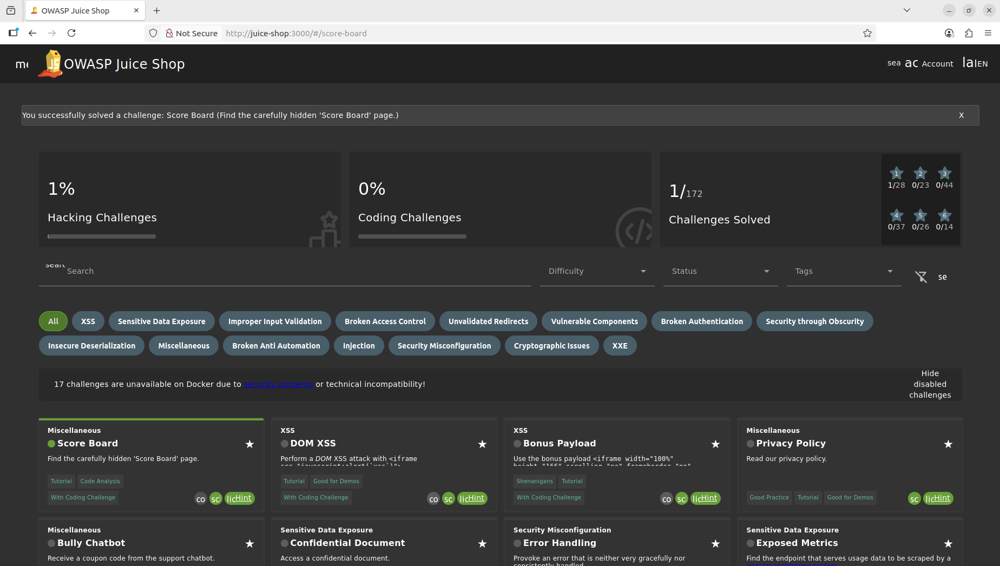

# Score board challenge

## Task

Find the carefully hidden 'Score Board' page. 

## Recon

This is beginner challenge in the miscellaneous category. The aim here is to get the user to perform reconnaisance of the application. To do this we launch BurpSuite or OWASP Zap, then proxy our brower traffic through the app. This will capture all the request / responses between the browser and the application.

When you analyse the requests made to the application, you can see that the browser is requesting pages and making API calls that we did not initiate. Since juice shop is a single-page application, there will be a lot of content that it needs to retrieve from the database to populate the contents of the page. These calls are typially made via API calls. For this particular challenge we are looking for any respons from the server that may indicate the url or path of the score board. 

Looking at the requests made to the server we see a GET request to `/api/Challenges/?name=Score%20Board` . Inspecting the response from the server to this request we see: 

```http
HTTP/1.1 200 OK
Access-Control-Allow-Origin: *
X-Content-Type-Options: nosniff
X-Frame-Options: SAMEORIGIN
Feature-Policy: payment 'self'
X-Recruiting: /#/jobs
Content-Type: application/json; charset=utf-8
Content-Length: 696
ETag: W/"2b8-EYxZPK4aDu1v54VnVdXrw491lH4"
Vary: Accept-Encoding
Date: Mon, 01 Sep 2025 11:15:32 GMT
Connection: keep-alive
Keep-Alive: timeout=5
```

```json
{"status":"success","data":[{"id":74,"key":"scoreBoardChallenge","name":"Score Board","category":"Miscellaneous","tags":"Tutorial,Code Analysis,With Coding Challenge","description":"Find the carefully hidden 'Score Board' page.","difficulty":1,"hint":"Try to find a reference or clue behind the scenes. Or simply guess what URL the Score Board might have.","hintUrl":"https://pwning.owasp-juice.shop/companion-guide/latest/part2/score-board.html#_find_the_carefully_hidden_score_board_page","mitigationUrl":null,"solved":false,"disabledEnv":null,"tutorialOrder":1,"codingChallengeStatus":0,"hasCodingChallenge":true,"createdAt":"2025-09-01T11:03:34.012Z","updatedAt":"2025-09-01T11:03:34.012Z"}]}
```

This isn't quite what we're looking for. There is another request however to `/rest/admin/application-configuration` and when we view the server response we can see the configuration setting for the app references to some of the paths in the app.  Looking further down in the response (or just searching for 'score'), we see the following:

```json
"securityTxt":{"contact":"mailto:donotreply@owasp-juice.shop","encryption":"https://keybase.io/bkimminich/pgp_keys.asc?fingerprint=19c01cb7157e4645e9e2c863062a85a8cbfbdcda",`"acknowledgements":"/#/score-board"`,"hiring":"/#/jobs","csaf":"/.well-known/csaf/provider-metadata.json"}
```

So from this section of json payload, we an see the `acknowledgements` key holds the path reference for /#/score-board.


