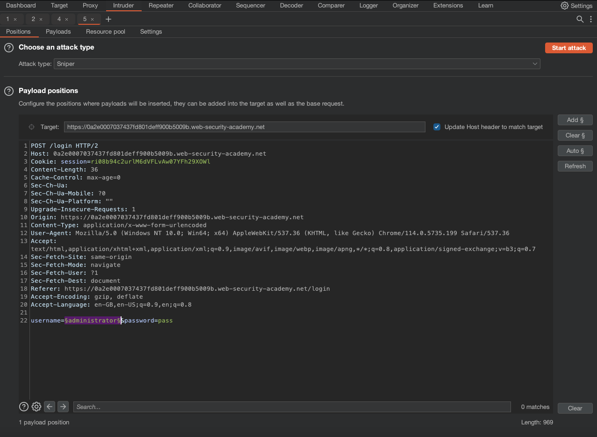
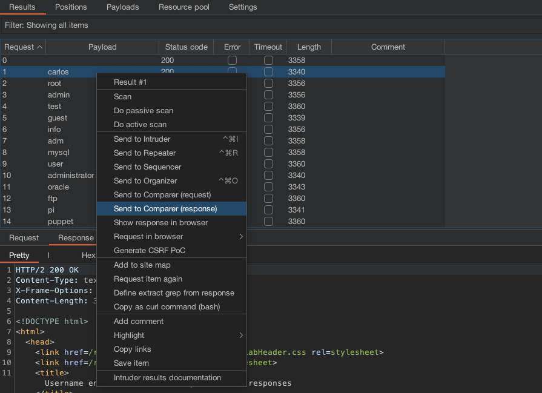
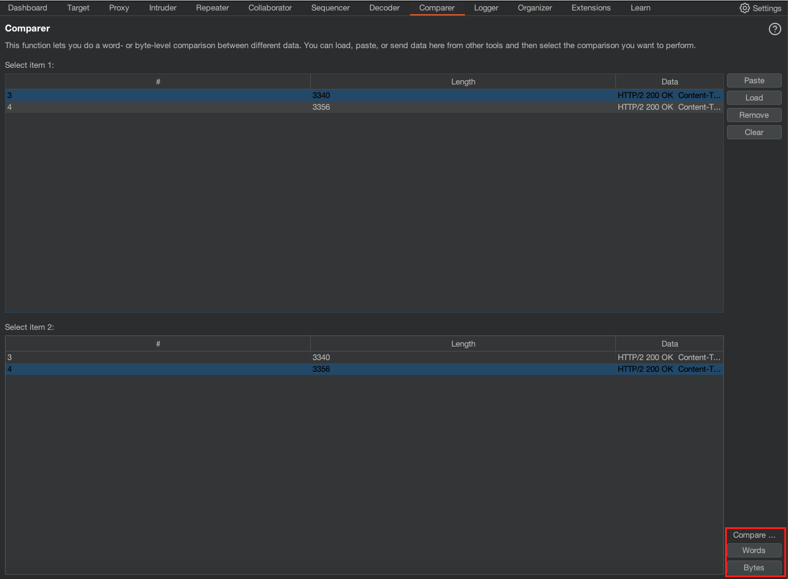
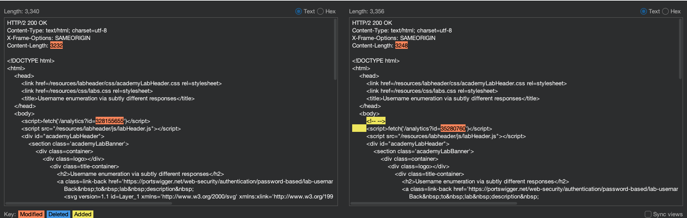
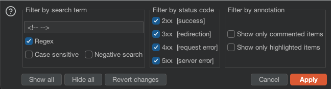
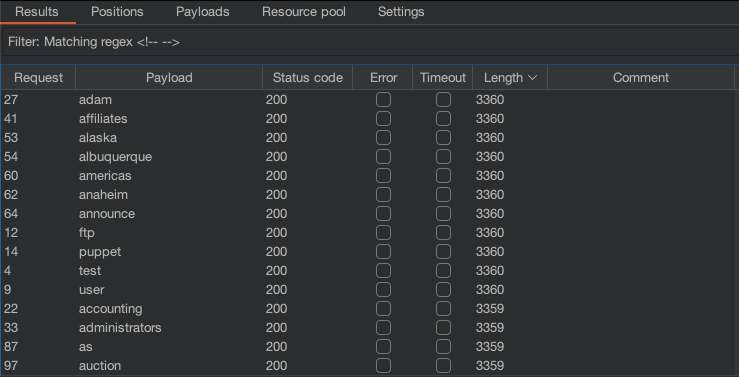
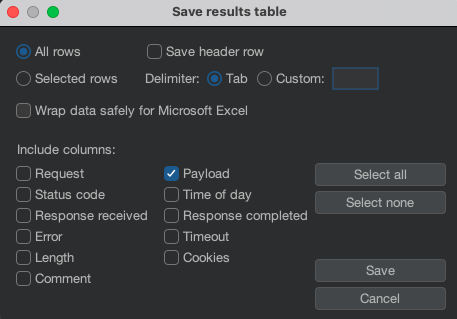
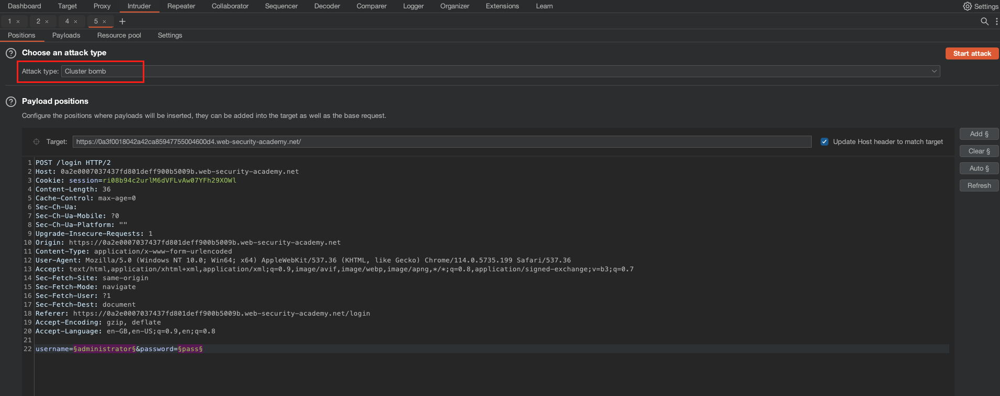
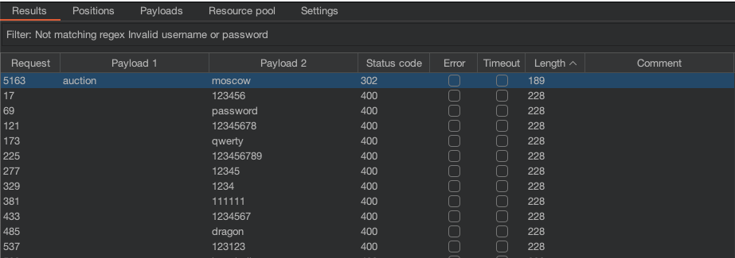

# Username enumeration via subtly different responses

## Goal
*This lab is subtly vulnerable to username enumeration and password brute-force attacks. It has an account with a predictable username and password, which can be found in the following wordlists:*
- [Candidate usernames](https://portswigger.net/web-security/authentication/auth-lab-usernames)
- [Candidate passwords](https://portswigger.net/web-security/authentication/auth-lab-passwords)

## Solving the lab

The point of the lab is to highlight User Enumeration techniques. This lab increases in difficulty from the pervious lab by no longer displaying the error "Incorrect username" if a username is valid but the password is incorrect.

We already have the username and password lists to solve the challenge, so the focus of the challenge is about learning to detect the difference in the overall responses. 

### Step 1

Make a login request and then send this to `Intruder`. In Burp Intruder we can add the field we want to dynamically change in the `Attack`. For this one, we highlight the username parameter and click add. 

## Step 2 

Now we analyse the server responses to our attack payload. The first thing to notice is that content length for the requests vary in sizes. This indicates that server is sending something different between the responses. To investigate, you can either sort the responses by `length`, or just check the difference between the `largest` response and the `smallest`.

To quickly see the difference between the two, you can send both responses to `Comparer`. 

In Comparer, select to compare `Words`(String data) or `Bytes` (Hex view). For this one, select `Words`. 

When selecting words you'll see sections of the response highlighted where they differ. 

When you analyse the responses, some responses have the comment `<!-- -->` under the body tag, but the others do not. You can test whether this means responses with comment tags map to valid accounts, by sending a request in `Repeater` using an account not on the list (or a random string). This will show you that the random string as the username does not result in a response with comment tags.

From this we can infer that the responses with the HTML comment are probably valid usernames.

## Step 3

Filter the `Results` to only show responses with the HTML comment tag.

From here, save the results by selecting `Save` -> `Save results table`. 

Now we can use this list in another Intruder attack, this time referencing the password list. 

# Step 4

In Intruder, select to add both the username and password parameters, and select the attack type as `Cluster bomb`.

Use the usernames we saved from the previous attack in payload 1, and the passwords in payload 2. Now start the attack. 

Check the results and filter them by any response that does not have the string `Invalid username or password`.

As you can see in the image above, the HTTP `302` response reveals that we have guessed the password correctly. When you send a `POST` request to submit a form, the normal application flow is to redirect you back to a page using a `GET` request. This prevents issues where the form is resubmitted. Ref: [Post/Redirect/Get](https://en.wikipedia.org/wiki/Post/Redirect/Get#:~:text=Post%2FRedirect%2FGet%20(PRG,submitting%20the%20form%20another%20time.))

Now you have the creds, you can login and solve the lab!
