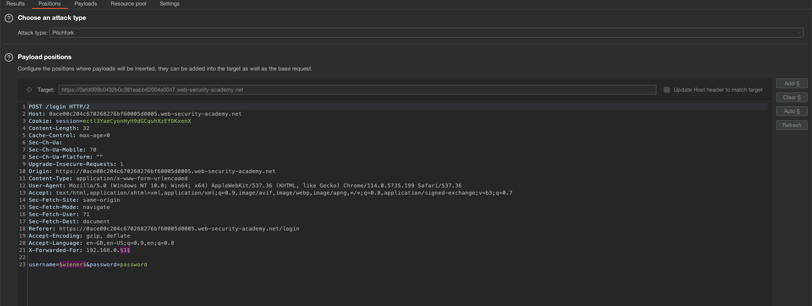
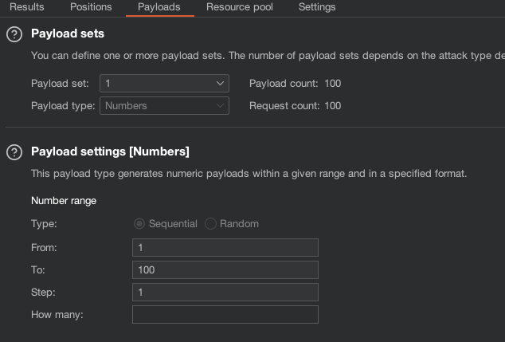
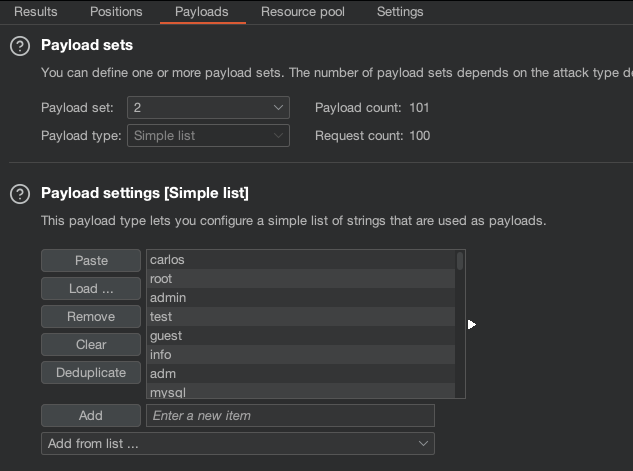

# Username enumeration via response timing

## Goal
*This lab is vulnerable to username enumeration using its response times. To solve the lab, enumerate a valid username, brute-force this user's password, then access their account page.:*
- Your credentials: wiener:peter
- [Candidate usernames](https://portswigger.net/web-security/authentication/auth-lab-usernames)
- [Candidate passwords](https://portswigger.net/web-security/authentication/auth-lab-passwords)

## Solving the lab

Given the name, this lab is all about demonstrating the technique to enumerate usernames from a web application, based on the timing of server responses. We are given one pair of credentials to use, and this is essential to our testing. 

In real world testing you can use a pair of valid credentials to determine if there is any difference in responses with your user, compared of another list of users. You can normally deduce if the response times were the same as your user, then these accounts are likely to exist in the application. 

### Step 1

For this lab, we start by making a few test login attempts using `Intruder`. We do this by adding the `username` as the variable and leaving the password as the same test value. The attack type for this should be set to `Sniper`.

After making the requests you'll notice `3` of the response times are the same, and the rest of the responses are all the same *BUT* different from the prior `3`. When you investigate this, you'll notice that after 3 attempts, the messages in the server response page show `too many attempts` and blocks us. Similar to the `Broken brute force protection - IP block` lab, this is an IP block and can be overcome by using the HTTP `X-Forwarded-For` header.

### Step 2 

When testing if the server is using the value in the X-Forwarded-For header, we can do the following:

- Send 4 login attempts and cause the the IP to be blocked.
- Add the X-Forwaded-For header to our request and specify another IP (i.e 127.0.0.1).

The result of this should be that we are no longer blocked sending the request, which means the server is using this HTTP header.

### Step 3

To properly enumerate the user, we now need to do the following: 

- Setup Intruder to rotate the X-Forwarder-For IP address on every request. Do this using a pitchfork attack and make sure the username and last octect of the X-Forwarded-For IP address is added.

- In the Intruder Payloads tab, add the usernames in payload `2` and use the number payloads for payload `1` (Assuming you added them in that order). The number list should at least be from 0-100 with a step of 1.

### Step 4

At this point, you can run the attack. When you analyse the response, look for eye catching differences in the response times. In this particular lab, one of the responses has a noticibly longer response time than the others. This is most likely the user we need. 

From here, you can 
- Change the positions in intruder to clear the username paraameter.
- Statically set the username parameter to the enumerated username
- Add the password parameter
- Change the payload `2` list to be passwords instead of usernames now.

This should allow you to successfully brute force the user's password (assuming X-Forwarded-For header is still set to rotate.) :tada:

## Alternative ways to solve the lab

As you may have guessed, this is another one we can automate using Python (Python is cool and I love it shhhh!)

To see an example of how this is done, checkout:

### [Username Enumeration via response times - Script](../../Scripts/Authentication/Username_Enum_response_times.py)
